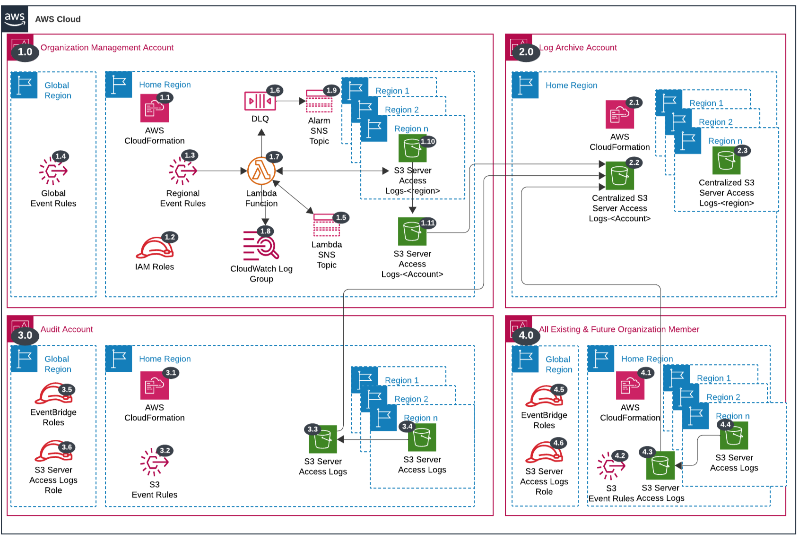

# S3 Server Access Logs<!-- omit in toc -->

Copyright Amazon.com, Inc. or its affiliates. All Rights Reserved. SPDX-License-Identifier: CC-BY-SA-4.0

## Table of Contents<!-- omit in toc -->

- [Introduction](#introduction)
- [Deployed Resource Details](#deployed-resource-details)
- [Implementation Instructions](#implementation-instructions)
- [References](#references)

## Introduction

The S3 Server Access Logs solution provides a scalable and centralized approach to managing and analyzing S3 access within each `AWS account` in the AWS Organization. With reliable and secure mechanism the feature logs all requests made to access S3 buckets, then delivers the access logs to an S3 bucket in a designated Log Archive account.

**Key solution features:**

- Sets S3 server access logs settings for all existing accounts including the `management account`, `audit account` and future accounts.
- Ability to exclude buckets from logging via provided account tags.
- Configures an account-wide multi-regional aggregator for logs within the `Home region`. 
- Ability to exclude regional logs buckets from being aggregated into Home region via provided account tags.
- Triggered when new accounts are added to the AWS Organization, account tag updates, and on account status changes.

## Deployed Resource Details

### 1.0 Organization Management Account<!-- omit in toc -->

#### 1.1 AWS CloudFormation<!-- omit in toc -->

- All resources are deployed via AWS CloudFormation as a `StackSet` and `Stack Instance` within the `management account` or a CloudFormation `Stack` within a specific account.
- The [Customizations for AWS Control Tower](https://aws.amazon.com/solutions/implementations/customizations-for-aws-control-tower/) solution deploys all templates as a CloudFormation `StackSet`.
- For parameter details, review the [AWS CloudFormation templates](templates/).
  
#### 1.2 IAM Roles<!-- omit in toc -->

- The `Lambda IAM Role` is used by the Lambda function to enable S3 Server Access Logging within each region provided.
- The `S3 Server Access Logs IAM Role` is assumed by the Lambda function to enable S3 Server Access Logs for the management account and the member accounts.
- The `EventBridge IAM Role` is assumed by EventBridge to forward Global events to the `Home Region` default Event Bus.

#### 1.3 Regional Event Rules<!-- omit in toc -->

- The `AWS Control Tower Lifecycle Event Rule` triggers the `AWS Lambda Function` when a new AWS Account is provisioned through AWS Control Tower.
- The `Organization Compliance Scheduled Event Rule` triggers the `AWS Lambda Function` to capture AWS Account status updates (e.g. suspended to active).
  - A parameter is provided to set the schedule frequency.
  - See the [Instructions to Manually Run the Lambda Function](#instructions-to-manually-run-the-lambda-function) for triggering the `AWS Lambda Function` before the next scheduled run time.
- The `AWS Organizations Event Rule` triggers the `AWS Lambda Function` when updates are made to accounts within the organization.
  - When AWS Accounts are added to the AWS Organization outside of the AWS Control Tower Account Factory. (e.g. account created via AWS Organizations console, account invited from another AWS Organization).
  - When tags are added or updated on AWS Accounts.

#### 1.4 Global Event Rules<!-- omit in toc -->

- If the `Home Region` is different from the `Global Region (e.g. us-east-1)`, then global event rules are created within the `Global Region` to forward events to the `Home Region` default Event Bus.
- The `AWS Organizations Event Rule` forwards AWS Organization account update events.

#### 1.5 SNS Topic<!-- omit in toc -->

- SNS Topic used to fanout the Lambda function for configuring the service within each account and region.

#### 1.6 Dead Letter Queue (DLQ)<!-- omit in toc -->

- SQS dead letter queue used for retaining any failed Lambda events.

#### 1.7 AWS Lambda Function<!-- omit in toc -->

- The AWS Lambda Function contains the logic for configuring S3 Server Access Logging.

#### 1.8 Lambda CloudWatch Log Group<!-- omit in toc -->

- All the `AWS Lambda Function` logs are sent to a CloudWatch Log Group `</aws/lambda/<LambdaFunctionName>` to help with debugging and traceability of the actions performed.
- By default the `AWS Lambda Function` will create the CloudWatch Log Group and logs are encrypted with a CloudWatch Logs service managed encryption key.
- Parameters are provided for changing the default log group retention and encryption KMS key.

#### 1.9 Alarm SNS Topic<!-- omit in toc -->

- SNS Topic used to notify subscribers when messages hit the Dead Letter Queue (DLQ).

#### 1.10 S3 Region-wide Bucket Logs<!-- omit in toc -->

- The `AWS Lambda Function` configures the s3 server access log settings for the region.

#### 1.11 S3 Account-wide Bucket Logs Settings<!-- omit in toc -->

- The `AWS Lambda Function` configures the replication rules for the account.

---

### 2.0 Log Archive Account<!-- omit in toc -->

#### 2.1 AWS CloudFormation<!-- omit in toc -->

- See [1.1 AWS CloudFormation](#11-aws-cloudformation)
- 
---

### 3.0 Audit Account<!-- omit in toc -->

#### 3.1 AWS CloudFormation<!-- omit in toc -->

- See [1.1 AWS CloudFormation](#11-aws-cloudformation)

---

### 4.0 All Existing and Future Organization Member Accounts<!-- omit in toc -->

#### 4.1 AWS CloudFormation<!-- omit in toc -->

- See [1.1 AWS CloudFormation](#11-aws-cloudformation)

## Implementation Instructions

## References

- [AWS CloudFormation](https://docs.aws.amazon.com/AWSCloudFormation/latest/UserGuide/Welcome.html)
- [Customizations for AWS Control Tower](https://aws.amazon.com/solutions/implementations/customizations-for-aws-control-tower/)